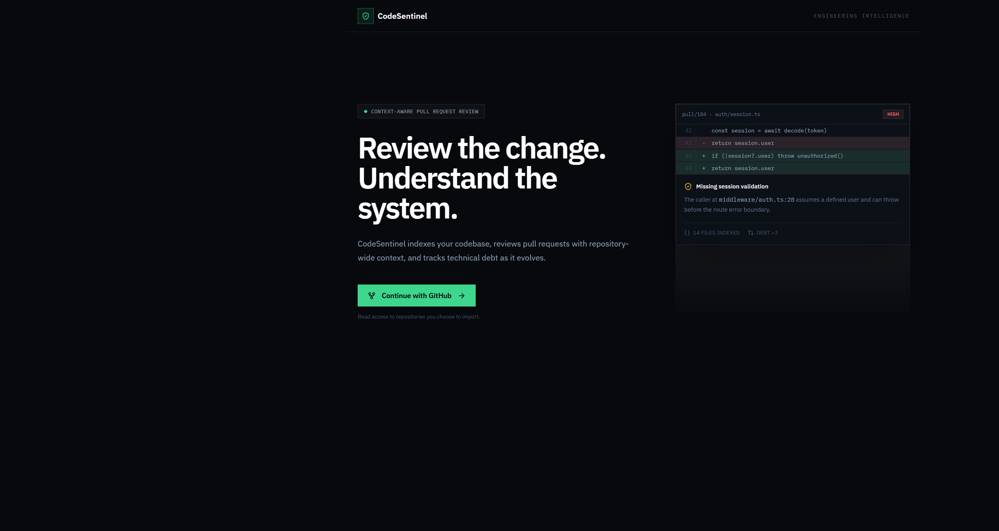
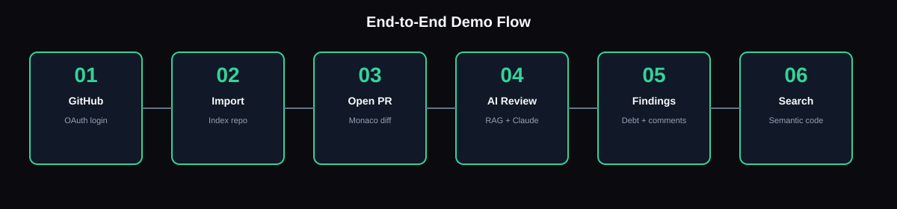
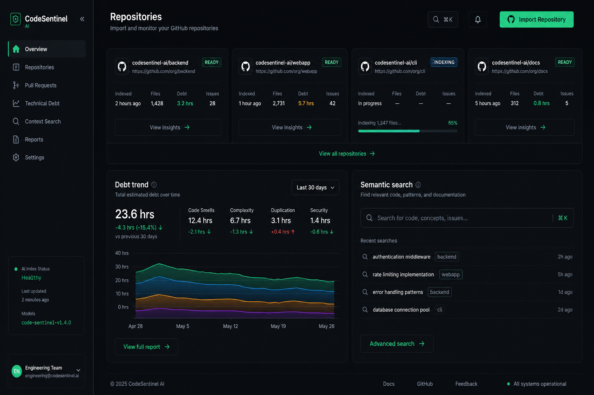
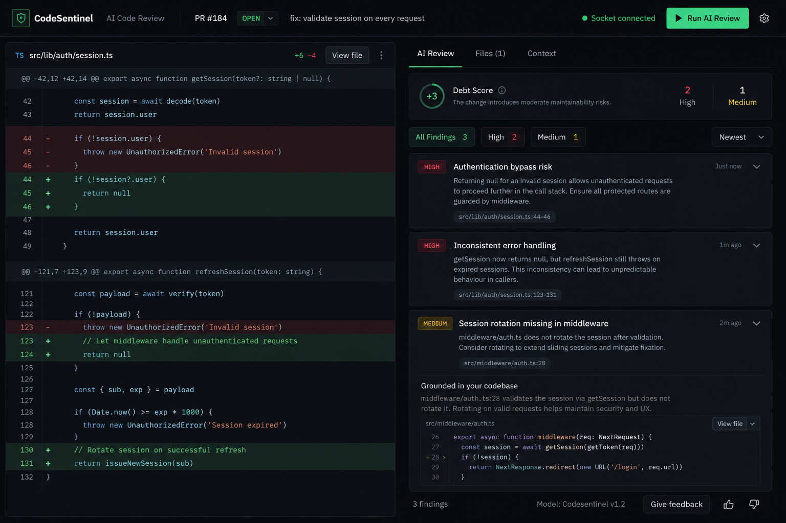

<div align="center">

# CodeSentinel AI

**GitHub-connected, RAG-powered code review — not just the diff, the whole codebase.**

[](https://nodejs.org/)
[](https://www.typescriptlang.org/)
[](https://react.dev/)
[](https://www.mongodb.com/)
[](https://redis.io/)
[](https://qdrant.tech/)
[](https://www.anthropic.com/)
[](./LICENSE)

[Live Demo](#-quick-start) · [Architecture](#-architecture) · [System Design](./SYSTEM_DESIGN.md) · [Deploy Guide](./DEPLOY.md)

**Repo:** [github.com/Shivampal157/CodeSentinel-AI](https://github.com/Shivampal157/CodeSentinel-AI)

</div>

---

## Why recruiters care

Most AI review tools only read the **PR diff**. CodeSentinel **indexes your repository**, retrieves related symbols at review time, and grounds Claude findings in real codebase context — so feedback can say *“this pattern also appears in `auth.service.ts`”*, not just *“looks wrong.”*

| What you get | Proof in this repo |
|---|---|
| **Full-stack product** | React + Express monorepo with auth, dashboard, PR workflow |
| **Real infra (no mocks)** | MongoDB · Redis · Qdrant · BullMQ · Socket.io |
| **RAG pipeline** | AST chunking → embeddings → vector search → Claude review |
| **Production mindset** | Docker Compose, CI, Prometheus metrics, health probes |
| **Systems design story** | API/worker split, Redis pub/sub, review cache, observability |

> Built for **SDE / full-stack / platform** interviews — end-to-end, deployable, and explainable.

---

## Product preview

<p align="center">
  
</p>

<p align="center"><em>Dark, engineering-first UI — GitHub OAuth, live PR preview, and grounded AI findings.</em></p>

---

## What it does

1. **Sign in** with GitHub OAuth  
2. **Import** a repository → background worker indexes code (AST chunks → embeddings → Qdrant)  
3. **Open a PR** by number → Monaco diff view  
4. **Run AI Review** → BullMQ job, RAG retrieval, Claude, Redis cache  
5. **Watch live status** over Socket.io  
6. **Search the codebase** in natural language  

No toy CRUD. Every dependency is a **real service** — Docker locally, or Atlas / Upstash / Qdrant Cloud for deploy.

---

## Demo flow

<p align="center">
  
</p>

| Step | What happens |
|------|----------------|
| **01 GitHub** | OAuth login, scoped repo access |
| **02 Import** | Worker queues embedding jobs, index status updates live |
| **03 Open PR** | Fetch diff from GitHub, render in Monaco |
| **04 AI Review** | Retrieve related chunks from Qdrant → Claude → findings |
| **05 Findings** | Severity, debt score, inline comments |
| **06 Search** | Semantic code search across indexed repo |

---

## Dashboard & workspace

<p align="center">
  
</p>

- Import GitHub repos and track **index status** (pending → indexing → ready)  
- **Debt trend** chart per repository  
- **Natural-language search** over indexed code  
- Platform stats & audit-friendly ops panel  

---

## AI review experience

<p align="center">
  
</p>

- Side-by-side **Monaco diff** for real PRs  
- **Grounded findings** with severity + file references  
- **Live job status** while the worker runs  
- **Redis cache** — identical diffs skip redundant Claude calls  

---

## Architecture

<p align="center">
  
</p>

```
┌─────────────┐     REST + WS      ┌──────────────┐
│  React app  │ ◄────────────────► │  Express API │
│  + Monaco   │                    │  + Socket.io │
└─────────────┘                    └──────┬───────┘
                                          │
              ┌───────────────────────────┼───────────────────────────┐
              ▼                           ▼                           ▼
         ┌─────────┐                ┌─────────┐                 ┌─────────┐
         │ MongoDB │                │  Redis  │                 │ Qdrant  │
         │ users,  │                │ cache,  │                 │ vectors │
         │ PRs,    │                │ BullMQ, │                 │  RAG    │
         │ reviews │                │ pub/sub │                 └────▲────┘
         └─────────┘                └────┬────┘                      │
                                         │                    embeddings
                                         ▼                      (Gemini /
                                   ┌───────────┐               OpenAI / Voyage)
                                   │  Worker   │
                                   │ embed +   │──────► Claude review
                                   │ ai-review │
                                   └───────────┘
```

**Design deep-dive:** [SYSTEM_DESIGN.md](./SYSTEM_DESIGN.md) — why Qdrant over Mongo vectors, Socket.io Redis adapter, chunking tradeoffs, review cache keys.

---

## Tech stack

| Layer | Technologies |
|-------|----------------|
| **Frontend** | React 18, TypeScript, Vite, Tailwind, Zustand, Monaco Editor |
| **API** | Express, Zod, Winston, Helmet, JWT, GitHub OAuth, rate limiting |
| **Worker** | BullMQ (`embedding`, `ai-review` queues) |
| **Realtime** | Socket.io + Redis adapter |
| **Data** | MongoDB · Redis · Qdrant |
| **AI** | Gemini / OpenAI / Voyage embeddings · Anthropic Claude |
| **Ops** | Docker Compose, Prometheus `/api/metrics`, GitHub Actions CI |

**Monorepo:** `apps/web` · `apps/api` · `apps/worker` · `packages/shared`

---

## Highlights for interviews

**Elevator pitch (30 sec):**  
> “I built a GitHub-connected code review platform that indexes repos into Qdrant, retrieves related code at review time, and runs Claude reviews through BullMQ workers with Redis caching and Socket.io live updates — full MERN-style stack with real infra, not mocks.”

**Talking points:**
- **RAG:** AST-aware chunking → embeddings → filtered vector search by `repoId` / `filePath`
- **Scale patterns:** Workers publish to Redis; API bridges into Socket.io rooms (no duplicate WS servers)
- **Cost control:** Review cache key = `sha256(headSha + patch)` — prove cache hits in logs
- **Observability:** `/api/health`, `/api/ready`, Prometheus metrics, CI on every push

---

## Quick start

**Prerequisites:** Node 20+, Docker Desktop (or cloud Mongo/Redis/Qdrant), API keys below.

```bash
git clone https://github.com/Shivampal157/CodeSentinel-AI.git
cd CodeSentinel-AI
cp .env.example .env
npm install
```

**Minimum `.env`:**

| Variable | Where to get it |
|----------|-----------------|
| `JWT_ACCESS_SECRET` / `JWT_REFRESH_SECRET` | `node -e "console.log(require('crypto').randomBytes(48).toString('hex'))"` |
| `GITHUB_CLIENT_ID` / `GITHUB_CLIENT_SECRET` | [GitHub OAuth Apps](https://github.com/settings/developers) — callback `http://localhost:4000/api/auth/github/callback` |
| `GEMINI_API_KEY` *(or OpenAI / Voyage)* | [Google AI Studio](https://aistudio.google.com/apikey) |
| `ANTHROPIC_API_KEY` | [Anthropic Console](https://console.anthropic.com/settings/keys) |

```bash
npm run infra:up      # Mongo + Redis + Qdrant (Docker)
npm run infra:verify  # optional sanity check
npm run dev           # API + web + worker
```

| Service | URL |
|---------|-----|
| Web | http://localhost:5173 |
| API health | http://localhost:4000/api/health |
| Metrics | http://localhost:4000/api/metrics |

**Free-tier tip:** `EMBEDDING_PROVIDER=gemini` and `INDEX_MAX_CHUNKS=80`

---

## Project layout

```
apps/
  api/       Express API — auth, RAG, review orchestration
  worker/    BullMQ processors (index + AI review)
  web/       React UI — dashboard, PR view, search
packages/
  shared/    Zod schemas, queue names, socket events
docker/      Production Dockerfiles + nginx
scripts/     Infra verify, smoke test
docs/
  screenshots/   README visuals
```

---

## Scripts

| Command | Description |
|---------|-------------|
| `npm run infra:up` | Start Mongo, Redis, Qdrant |
| `npm run infra:verify` | Ping infra from host |
| `npm run dev` | API + web + worker together |
| `npm test` | Jest — chunking, metrics, RAG helpers |
| `npm run smoke` | Hit `/health`, `/ready`, `/metrics` |
| `npm run docker:prod` | Full production Compose stack |

---

## Observability & CI

| Endpoint | Purpose |
|----------|---------|
| `GET /api/health` | Liveness |
| `GET /api/ready` | Mongo / Redis / Qdrant readiness |
| `GET /api/metrics` | Prometheus — latency, cache hits, review counts |
| `GET /api/stats` | Authenticated platform stats |

GitHub Actions runs **typecheck · lint · test · Docker builds** on every push ([`.github/workflows/ci.yml`](./.github/workflows/ci.yml)).

Production deploy: [DEPLOY.md](./DEPLOY.md)

---

## Author

**Shivam Pal** — IIIT Agartala (B.Tech CSE, 2028)  
[GitHub](https://github.com/Shivampal157) · [LinkedIn](https://linkedin.com/in/shivam-pal-677777301)

---

## License

MIT — use it, fork it, break it, improve it.
